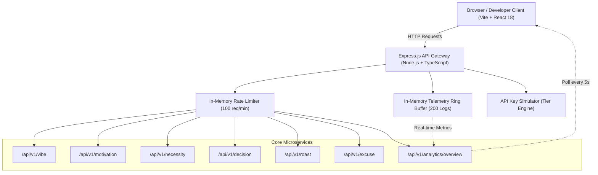

# USELESS API 🎯
> **Infrastructure for problems nobody has.**

[](https://tinkerhub.org/events/1M8ORET9A1/useless-projects-3.0)
[](https://opensource.org/licenses/MIT)
[](https://www.typescriptlang.org/)
[](https://reactjs.org/)
[](https://expressjs.com/)

---

## Basic Details
### Team Name: HELL YEAH

### Team Members
- Team Lead: Jiss Hajan - [College / Institution] <!-- 🧑‍💻 HUMAN ACTION REQUIRED: Update college name -->
- Member 2: [Name] - [College] <!-- 🧑‍💻 HUMAN ACTION REQUIRED: Add teammate name & college if applicable -->
- Member 3: [Name] - [College] <!-- 🧑‍💻 HUMAN ACTION REQUIRED: Add teammate name & college if applicable -->

### Project Description
USELESS API is enterprise-grade cloud API infrastructure engineered to solve problems that fundamentally do not exist. Styled like Stripe, Supabase, and Cloudflare, it pairs serious developer experience—an interactive playground, real-time telemetry ring buffer, and live analytics—with satirical, mathematically absurd utility endpoints.

### The Problem (that doesn't exist)
In modern software engineering, developers are plagued by existential micro-dilemmas:
- *Should I rewrite this stable code in Rust at 3:00 AM?*
- *Is this meeting genuinely necessary, or could it have been a Slack emoji reaction?*
- *Why did my staging build fail when Mercury was in retrograde?*
- *Who will ruthlessly roast my tech stack without emotional bias?*

Until now, zero cloud providers offered high-availability microservices to answer these pressing non-issues.

### The Solution (that nobody asked for)
USELESS API delivers six hyper-engineered, low-latency microservices with zero external database dependencies:
1. **Decision Engine (`POST /api/v1/decision`)**: Deterministic decision-making with overengineered justification algorithms.
2. **Vibe Check (`GET /api/v1/vibe`)**: Astrological and developer energy diagnostics with chaos indices.
3. **Existential Motivation (`GET /api/v1/motivation`)**: Unhelpful, candid productivity wisdom.
4. **Meeting Necessity Oracle (`GET /api/v1/necessity`)**: Scientific calculation of whether a meeting should be cancelled.
5. **Tech Stack Roaster (`POST /api/v1/roast`)**: Brutal, algorithmic architectural critiques.
6. **Enterprise Excuse Generator (`POST /api/v1/excuse`)**: Plausible corporate and technical scapegoats.

---

## Technical Details
### Technologies/Components Used
For Software:
- **Languages used**: TypeScript (ES2022) for strict end-to-end type safety across client and server.
- **Frameworks used**: Express.js (backend HTTP REST gateway), React 18 with Vite (frontend client).
- **Libraries used**: Tailwind CSS (dark developer UI), Lucide React (feather-style developer icons), React Router v6 (client-side routing).
- **Tools used**: `tsx` (TypeScript Node runtime), Git, npm, Vercel SPA routing (`vercel.json`).
- **Data & State**: 100% in-memory telemetry ring buffer (sliding window of 200 requests), per-IP rate-limiting bucket (100 req/min), simulated API key tiering (`enterprise`, `pro`, `hobbyist`, `guest`), zero external database or Redis required.

For Hardware:
- *N/A (Pure Software / Web & Cloud API Gateway)*

---

## Implementation
### Architecture Overview


### Installation
```bash
# Clone the repository
git clone https://github.com/jisssz/hell-yeah-useless-api.git
cd hell-yeah-useless-api

# Install backend dependencies
cd server
npm install

# Install frontend dependencies
cd ../client
npm install
```

### Run Locally
```bash
# 1. Start the Backend Gateway (from server/)
cd server
npm run dev
# Server listens on http://localhost:3001

# 2. In a separate terminal, start the Frontend (from client/)
cd client
npm run dev
# Frontend dev server opens at http://localhost:5173
```

### Production Build
```bash
# Build backend TypeScript
cd server
npm run build
npm start

# Build frontend production bundle
cd ../client
npm run build
npm run preview
```

---

## API Catalog & Reference
All endpoints return standard JSON responses with telemetry headers: `X-Request-Id`, `X-Response-Time`, `X-RateLimit-Limit`, and `X-RateLimit-Remaining`.

| Method | Endpoint | Description | Sample Request Payload |
|---|---|---|---|
| `GET` | `/api/v1/vibe` | Developer energy & cosmos vibe reading | *None* |
| `GET` | `/api/v1/motivation` | Counter-productive motivational advice | *None* |
| `GET` | `/api/v1/necessity?duration=45&attendees=6` | Meeting necessity calculator & cancellation excuse | `?duration=45&attendees=6` |
| `POST` | `/api/v1/decision` | Deterministic binary resolution | `{"question": "Should I refactor in Rust?"}` |
| `POST` | `/api/v1/roast` | Architectural stack roast | `{"stack": ["PHP", "jQuery", "WordPress"]}` |
| `POST` | `/api/v1/excuse` | Corporate & engineering scapegoats | `{"category": "deployment"}` |
| `GET` | `/api/v1/analytics/overview` | Global telemetry metrics & live logs | *None* |

---

## Project Documentation
For Software:

### Screenshots (Add at least 3)

*Landing page showcasing enterprise design system, value propositions, and live metric preview.*
<!-- 🧑‍💻 HUMAN ACTION REQUIRED: Add real screenshot to docs/screenshots/landing.png or update URL -->


*Interactive Playground allowing real-time parameter tuning, cURL generation, and live execution.*
<!-- 🧑‍💻 HUMAN ACTION REQUIRED: Add real screenshot to docs/screenshots/playground.png or update URL -->


*Real-time analytics dashboard displaying traffic breakdown, latency spectrum, and in-memory event stream.*
<!-- 🧑‍💻 HUMAN ACTION REQUIRED: Add real screenshot to docs/screenshots/analytics.png or update URL -->

### Diagrams

*End-to-end request lifecycle: Client UI -> Express Middleware -> Ring Buffer Telemetry -> Microservice Execution.*
<!-- The mermaid diagram above renders natively on GitHub. To export as an image, save to docs/architecture.png -->

For Hardware:
*(N/A - Software API)*

---

## Project Demo
### Video
[Demo Video Link](https://youtu.be/placeholder)
*A 2-minute walkthrough of the USELESS API developer portal, live API Playground, cURL integration, and real-time telemetry streaming.*
<!-- 🧑‍💻 HUMAN ACTION REQUIRED: Replace with your actual video link (YouTube/Loom) -->

### Additional Demos
- **GitHub Repository**: [https://github.com/jisssz/hell-yeah-useless-api](https://github.com/jisssz/hell-yeah-useless-api)
- **Local API Playground**: `http://localhost:5173/playground`
- **Live Gateway Health**: `http://localhost:3001/health`
- **Telemetry Stream**: `http://localhost:3001/api/v1/analytics/overview`

---

## Team Contributions
- **Jiss Hajan**: Architecture, Backend Express gateway, API design, telemetry ring buffer, React frontend, Interactive Playground, and documentation.
<!-- 🧑‍💻 HUMAN ACTION REQUIRED: Update team roles and contributions if collaborating with teammates -->

---
Made with ❤️ at TinkerHub Useless Projects 


