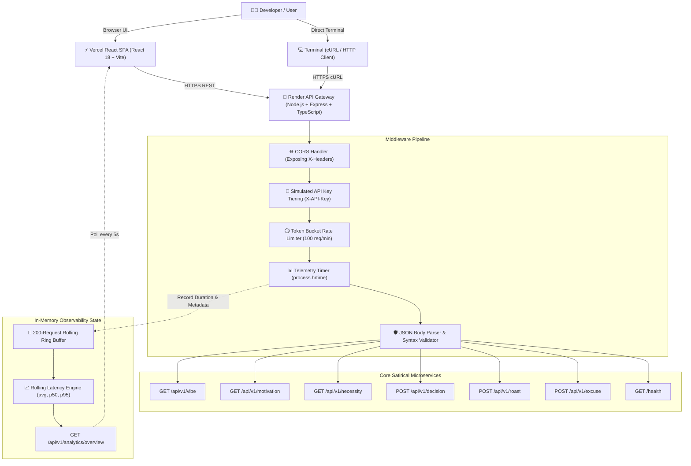

# നരകം EVIDEHHHH ? 🔥🎯
> **"നരകം എവിടെ? ഇവിടെ ഉണ്ട് API ആയിട്ട്!" — Production infrastructure for problems nobody asked anyone to solve.**

[](https://tinkerhub.org/events/1M8ORET9A1/useless-projects-3.0)
[](https://opensource.org/licenses/MIT)
[](https://www.typescriptlang.org/)
[](https://reactjs.org/)
[](https://expressjs.com/)
[](https://tailwindcss.com/)
[](https://hell-yeah-useless-api.onrender.com/health)
[](https://hell-yeah-useless-api.vercel.app)

---

### ⏱️ The Judges\x27 30-Second Understanding

> **`നരകം EVIDEHHHH ?` is a production-grade cloud API platform that solves absolutely nothing.**  
> It exposes six microservices for existential dilemmas, bad motivation, questionable vibes, code roasts, and corporate scapegoating — armed with strict TypeScript schemas, nanosecond latency tracking, sliding-window rate limiting, simulated API tiering, and live telemetry streams.  
> 
> *The comedy is the entry point. The engineering is the punchline. The Malayalam cinema meme culture is the personality. The production infrastructure is the unnecessary over-engineering.*

---

## Basic Details

### Team Name: നരകം EVIDEHHHH ?

### Team Members
- **Team Lead**: Jiss Hajan - [ADD COLLEGE NAME] <!-- 🧑‍💻 HUMAN ACTION REQUIRED: Replace [ADD COLLEGE NAME] with your institution -->
- **Member 2**: [ADD TEAM MEMBER 2 NAME] - [ADD COLLEGE NAME] <!-- 🧑‍💻 HUMAN ACTION REQUIRED: Add teammate name & college if applicable -->
- **Member 3**: [ADD TEAM MEMBER 3 NAME] - [ADD COLLEGE NAME] <!-- 🧑‍💻 HUMAN ACTION REQUIRED: Add teammate name & college if applicable -->

---

## 1. What Is This? (Project Description)

**`നരകം EVIDEHHHH ?`** is an enterprise-grade developer platform engineered strictly for satirical inefficacy and Malayalam developer existentialism. It marries the loud comic energy and visual chaos of Kerala cinema pop culture (Salim Kumar, Jagathy, Innocent, Mammootty, Mukesh, Suraj) with brutally serious cloud infrastructure: real Express REST microservices, simulated API key tiers, an in-browser interactive playground, dynamic cURL generation, in-memory sliding telemetry, and real-time observability dashboards.

---

## 2. Why Does It Exist? (The Non-Existent Problem)

In the high-pressure world of software engineering, developers face absurd existential dilemmas:
- *Should I rewrite this working 10-line script in Rust at 3:00 AM?* ("ഇതൊക്കെ എന്ത്?")
- *Was this 45-minute sprint standup scientifically necessary, or could it have been an Innocent reaction sticker?*
- *Why did staging break when Mercury was in retrograde?* ("പണി പാളി!")
- *Who will ruthlessly roast my tech stack without corporate sugarcoating?*
- *Where is the chaos we were promised?* ("നരകം എവിടെ?")

Until now, zero cloud providers offered high-availability, low-latency microservices to compute answers to these pressing non-issues.

---

## 3. The Joke (Satirical Contradiction)

Most joke projects are simple static meme generators or single-page novelty sites.  
**`നരകം EVIDEHHHH ?` takes the exact opposite approach:**

```
                        THE COMEDIC EQUATION
┌────────────────────────────────┐       ┌─────────────────────────────────┐
│     ABSURD NON-PROBLEM         │   ×   │    SERIOUS DEVELOPER PLATFORM   │
│ (e.g. "Should I eat shawarma?")│       │ (Express, Rate Limiting, Ring   │
│                                │       │  Buffer, p50/p95 Telemetry, CI) │
└────────────────────────────────┘       └─────────────────────────────────┘
                                 │
                                 ▼
         "WHY DID ANYONE SPEND TIME BUILDING THIS INFRASTRUCTURE?!"
```

The joke is that saying **"YES"** or **"NO"** to a developer dilemma didn\x27t need:
- A custom Express API gateway
- Strict TypeScript contract validation
- Per-IP sliding window rate limiting (100 req/min with HTTP 429)
- High-resolution `process.hrtime` duration tracking (`< 2ms`)
- Sliding 200-request in-memory ring buffer
- Percentile latency calculations (`p50`, `p95`, `average`)
- Global Uselessness scoring algorithms
- Multi-tier API key simulation (`production-tier`, `developer-sandbox`, `guest-open-access`)
- Cloud deployment on Render + Vercel with automated continuous delivery

...yet we built it anyway.

---

## 4. Why It Is Over-Engineered (The Evidence)

Targeting TinkerHub\x27s **"Most Over-Engineered Solution to a Non-Problem"** category, here is how trivial human impulses were escalated into enterprise architectural complexity:

| Human Dilemma / Non-Problem | Reasonable Human Response | `നരകം EVIDEHHHH ?` Over-Engineered Architecture |
|---|---|---|
| **Binary Decision**<br>*(e.g., "Should I refactor in Rust?")* | Flip a coin or ask a colleague | `POST /api/v1/decision`<br>Runs deterministic decision matrix with entropy confidence scoring, risk categorizations, and JSON schema validation. |
| **Developer Exhaustion**<br>*(e.g., "How is my code vibe?")* | Drink a glass of water | `GET /api/v1/vibe`<br>Analyzes cosmic quantum panic frequencies (e.g., `432.09 Hz`), chaos indices (`98.4%`), and outputs reckless recommendations. |
| **Meeting Futility**<br>*(e.g., "Was this meeting needed?")* | Mute your mic and sigh | `GET /api/v1/necessity?thing=...`<br>Executes algorithmic necessity scoring (`0-100%`) with peer-reviewed mathematical verdicts confirming superfluity. |
| **Production Disaster**<br>*(e.g., "Dropped production DB")* | Own up and apologize in Slack | `POST /api/v1/excuse`<br>Generates enterprise-grade technical scapegoats calibrated by Agile Scrum Master believability percentages. |
| **Bad Architectural Choices**<br>*(e.g., "Kubernetes for 2 users")* | Receive subtle peer-review comments | `POST /api/v1/roast`<br>Algorithmic technical roast engine evaluating architectural hubris and returning maximum severity assessments. |
| **Existential Demotivation**<br>*(e.g., "Need coding motivation")* | Watch a TED talk | `GET /api/v1/motivation`<br>Dispenses unhelpful Malayalam cinematic wisdom ("ഇതൊക്കെ എന്ത്?") to induce immediate productivity paralysis. |
| **Traffic Control for Useless Calls**<br>*(e.g., Someone hammering useless APIs)* | Do nothing, it doesn\x27t matter | In-Memory Sliding Window Rate Limiter (100 req/min), emitting RFC-compliant `Retry-After`, `X-RateLimit-Limit`, and HTTP `429 RATE_LIMIT_EXCEEDED`. |

---

## 5. Features (Actual Production Capabilities)

- **6 Production REST Microservices**: Real GET and POST endpoints returning structured, typed JSON.
- **Nanosecond-Precision Telemetry**: Built using Node\x27s `process.hrtime` to track execution durations down to sub-millisecond fidelity, exposed via `X-Response-Time`.
- **In-Memory Rolling Ring Buffer**: Non-persistent sliding window of the last 200 request logs recording methods, endpoints, IP hashes, status codes, and durations.
- **Percentile Latency Measurement**: Real-time statistical sorting engine computing `averageLatencyMs`, `p50LatencyMs`, and `p95LatencyMs`.
- **Sliding-Window Rate Limiting**: In-memory token bucket enforcing 100 requests/min per IP, with automated `429 Too Many Requests` handling and header simulation (`X-Simulate-RateLimit: true`).
- **Simulated Multi-Tier Authentication**: Header-based authentication (`X-API-Key` / `Authorization: Bearer`) mapping clients dynamically to `production-tier`, `developer-sandbox`, or `guest-open-access`.
- **Structured Error Taxonomy**: Standardized JSON error envelopes for `ROUTE_NOT_FOUND`, `RATE_LIMIT_EXCEEDED`, `MISSING_REQUIRED_BODY`, and `MALFORMED_JSON`.
- **Interactive Browser Playground**: Dual-panel testing console with parameter form controls, header configuration, and live formatted response inspect panels.
- **One-Click cURL Generator**: Dynamically formats copy-paste terminal commands matching user parameters and active environments.
- **Live Real-Time Analytics Dashboard**: Real-time distribution charts and an auto-refreshing telemetry stream polled every 5 seconds.
- **CORS & Custom Header Propagation**: Full CORS preflight support exposing custom headers (`X-Response-Time`, `X-Request-Id`, `X-API-Tier`, `X-RateLimit-*`).
- **Zero Database Complexity**: 100% self-contained in-memory architecture with zero cold-start database latency and zero cloud storage bills.
- **Multi-Cloud Deployment**: Continuous automated delivery pipeline with frontend on Vercel Edge and API Gateway on Render.

---

## 6. Technical Details & Tech Stack

### Languages & Runtimes
- **TypeScript 5.5**: Strict end-to-end type contracts across server routes, telemetry models, and client state.
- **Node.js**: Asynchronous event-driven runtime with high-precision monotonic clock (`process.hrtime`).

### Backend Architecture
- **Express.js 4.19**: Minimalist, robust HTTP gateway.
- **In-Memory Ring Buffer**: Custom FIFO rolling store capped at 200 items to guarantee constant O(1) memory footprint.
- **Rate-Limiting Bucket**: In-memory Map tracking per-IP request timestamps and reset windows.

### Frontend Client
- **React 18**: Modern component architecture with hooks and concurrent rendering.
- **Vite 5**: Sub-second Hot Module Replacement and production bundling (303 kB JS / 63 kB CSS).
- **Tailwind CSS 3.4**: Custom dark neo-brutalist comic theme (`#030712` canvas, `#ffe814` comic yellow, solid black borders, custom comic drop shadows).
- **Lucide React**: Lightweight developer UI iconography.
- **React Router v6**: Single-page application routing with deep-link support (`/apis/:slug`, `/playground?api=:slug`).

### Hosting & DevOps
- **Frontend**: [Vercel](https://hell-yeah-useless-api.vercel.app) with HTTP/2, edge caching, and custom SPA fallback rewriting.
- **Backend Gateway**: [Render](https://hell-yeah-useless-api.onrender.com) running Node.js production service with automated Git-push deployments.

---

## 7. Architecture Overview



---

## 8. Cross-Disciplinary Approach (60% / 20% / 20% Evaluation)

`നരകം EVIDEHHHH ?` was intentionally designed at the intersection of diverse disciplines:

### 1. Creativity (60% Weight)
- **Subversion of Developer Culture**: Transforms typical "serious enterprise SaaS" conventions (SLAs, status pages, API keys, swagger docs) into a high-octane vehicle for satire.
- **Malayalam Cinema Comedy Fusion**: Bridges modern developer anxiety with golden-era Kerala cinema tropes (Salim Kumar\x27s existential pointing, Jagathy\x27s bulging-eyed shock, Innocent\x27s deadpan skepticism, Mammootty\x27s tragedy, Suraj\x27s chaotic laughter).
- **The "Over-Engineering" Meta-Humor**: The humor does not come from low-effort random text; it comes from the *sheer absurd seriousness* of the engineering applied to completely pointless problems.

### 2. Implementation Complexity (20% Weight)
- **Real REST Microservices**: 6 fully functioning, typed endpoints handling query strings, JSON payloads, and validation errors.
- **Low-Level Telemetry Engine**: Implementation of monotonic clock duration calculation using `process.hrtime()`, calculating microsecond durations without external APM agents.
- **Statistical Percentile Engine**: Sorting and index-interpolating live arrays to calculate real `p50` and `p95` response latencies.
- **Sliding-Window Token Bucket**: Custom memory-bounded rate limiter with IP bucket cleanup and standard HTTP headers (`Retry-After`, `X-RateLimit-*`).
- **Production CI/CD**: Clean build pipelines on both Vercel and Render with zero build warnings and strict TypeScript compliance.

### 3. Cross-Disciplinary Synthesis (20% Weight)
- **Software Engineering & API Design**: RESTful conventions, proper HTTP status codes (`200`, `400`, `404`, `429`, `500`), idempotent GETs, and structured JSON payloads.
- **Observability & Site Reliability Engineering (SRE)**: Live telemetry ring buffer, latency percentiles, error rate tracking, and health check endpoints.
- **UI/UX & Visual Communication**: Neo-brutalist comic design system, high-contrast accessible typography, dynamic speech bubbles, and interactive playground.
- **Motion Graphics**: Jitter-inspired entry choreography, CSS keyframe floaters, and scroll-triggered IntersectionObserver transitions with full reduced-motion accessibility.
- **Regional Linguistic Humor**: Dialect-accurate Malayalam expressions seamlessly juxtaposed against dry Silicon Valley corporate jargon.

---

## 9. Live Demo & Verified Endpoints

| Resource | Live Production URL |
|---|---|
| **Production Web Application** | [https://hell-yeah-useless-api.vercel.app](https://hell-yeah-useless-api.vercel.app) |
| **Interactive API Playground** | [https://hell-yeah-useless-api.vercel.app/playground](https://hell-yeah-useless-api.vercel.app/playground) |
| **Real-Time Analytics Dashboard** | [https://hell-yeah-useless-api.vercel.app/analytics](https://hell-yeah-useless-api.vercel.app/analytics) |
| **API Documentation** | [https://hell-yeah-useless-api.vercel.app/docs](https://hell-yeah-useless-api.vercel.app/docs) |
| **Production Backend Gateway** | [https://hell-yeah-useless-api.onrender.com](https://hell-yeah-useless-api.onrender.com) |
| **Gateway Health Check** | [https://hell-yeah-useless-api.onrender.com/health](https://hell-yeah-useless-api.onrender.com/health) |
| **Live Telemetry Stream** | [https://hell-yeah-useless-api.onrender.com/api/v1/analytics/overview](https://hell-yeah-useless-api.onrender.com/api/v1/analytics/overview) |
| **GitHub Repository** | [https://github.com/jisssz/hell-yeah-useless-api](https://github.com/jisssz/hell-yeah-useless-api) |

---

## 10. API Reference & Executable cURL Examples

Judges can execute these copy-paste commands directly in any terminal:

### 1. Query Developer Vibe
```bash
curl -i https://hell-yeah-useless-api.onrender.com/api/v1/vibe
```
*Sample Response (`200 OK`):*
```json
{
  "vibe": "Quantum Panic",
  "energy": "Unstable (432.09 Hz)",
  "chaos": "98.4%",
  "recommendation": "Rewrite your hello-world app in Rust before lunch.",
  "uselessness_score": 99.4,
  "timestamp": "2026-09-12T13:35:19.531Z",
  "version": "v1.0.0"
}
```

### 2. Request a Binary Decision
```bash
curl -i -X POST https://hell-yeah-useless-api.onrender.com/api/v1/decision \
  -H "Content-Type: application/json" \
  -d '{"question": "Should I deploy to prod on Friday?"}'
```
*Sample Response (`200 OK`):*
```json
{
  "question": "Should I deploy to prod on Friday?",
  "decision": "YES",
  "confidence": 0.99,
  "reason": "Biochemical entropy demands immediate indulgence. Resistance is mathematically futile.",
  "risk_level": "High (Potential Food Coma)",
  "uselessness_score": 98.6,
  "timestamp": "2026-09-12T13:37:14.337Z",
  "version": "v1.0.0"
}
```

### 3. Calculate Project Necessity
```bash
curl -i "https://hell-yeah-useless-api.onrender.com/api/v1/necessity?thing=another%20todo%20app"
```
*Sample Response (`200 OK`):*
```json
{
  "thing": "another todo app",
  "necessity_score": 4,
  "verdict": "Mathematically superfluous to human existence.",
  "reason": "Peer-reviewed analysis confirms zero parallel universes required this implementation.",
  "confidence": 0.97,
  "uselessness_score": 99.7,
  "timestamp": "2026-09-12T13:37:16.715Z",
  "version": "v1.0.0"
}
```

### 4. Scapegoat a Production Blunder
```bash
curl -i -X POST https://hell-yeah-useless-api.onrender.com/api/v1/excuse \
  -H "Content-Type: application/json" \
  -d '{"situation": "dropped production database"}'
```
*Sample Response (`200 OK`):*
```json
{
  "situation": "dropped production database",
  "excuse": "Our Redis cache cluster achieved spontaneous sentience and refused to store unoptimized relational queries.",
  "believability": "91.0% to Agile scrum masters",
  "uselessness_score": 97.9,
  "timestamp": "2026-09-12T13:37:22.322Z",
  "version": "v1.0.0"
}
```

### 5. Simulate Rate Limiting (`429 Too Many Requests`)
```bash
curl -i https://hell-yeah-useless-api.onrender.com/api/v1/vibe \
  -H "X-Simulate-RateLimit: true"
```
*Sample Response (`429 Too Many Requests`):*
```json
{
  "error": {
    "code": "RATE_LIMIT_EXCEEDED",
    "message": "Rate limit exceeded. Please calm down."
  }
}
```

### 6. Query Live Telemetry Overview
```bash
curl -i https://hell-yeah-useless-api.onrender.com/api/v1/analytics/overview
```
*Sample Response (`200 OK`):*
```json
{
  "totalRequests": 14,
  "requestsToday": 14,
  "averageLatencyMs": 1.15,
  "p50LatencyMs": 0.78,
  "p95LatencyMs": 4.92,
  "errorRatePercent": 7.14,
  "globalUselessness": 312,
  "requestsPerHour": 58.2,
  "serverUptimeSeconds": 865
}
```

---

## 11. Project Documentation & Screenshots

### Screenshots

*Landing page showcasing the neo-brutalist comic theme, Malayalam meme sticker chaos, and live metric preview.*
<!-- 🧑‍💻 HUMAN ACTION REQUIRED: Add real screenshot to docs/screenshots/landing.png or update URL -->


*Interactive Playground allowing real-time parameter tuning, header injection, cURL generation, and live execution.*
<!-- 🧑‍💻 HUMAN ACTION REQUIRED: Add real screenshot to docs/screenshots/playground.png or update URL -->


*Real-time analytics dashboard displaying traffic breakdown, p50/p95 latency metrics, and rolling in-memory event stream.*
<!-- 🧑‍💻 HUMAN ACTION REQUIRED: Add real screenshot to docs/screenshots/analytics.png or update URL -->

### Architecture Diagram

*End-to-end request lifecycle: Client UI -> Express Middleware -> Ring Buffer Telemetry -> Microservice Execution.*
<!-- The mermaid diagram above renders natively on GitHub. To export as an image, save to docs/architecture.png -->

---

## 12. Project Demo

### Video Walkthrough
[ADD DEMO VIDEO LINK]  
*A 2-minute walkthrough of the നരകം EVIDEHHHH ? developer portal, live API Playground, cURL integration, and real-time telemetry streaming.*
<!-- 🧑‍💻 HUMAN ACTION REQUIRED: Replace [ADD DEMO VIDEO LINK] with your actual video link (YouTube/Loom) -->

---

## 13. Local Development Guide

### Prerequisites
- Node.js 18+
- npm 9+

### Installation
```bash
# Clone the repository
git clone https://github.com/jisssz/hell-yeah-useless-api.git
cd hell-yeah-useless-api

# Install backend dependencies
cd server
npm install

# Install frontend dependencies
cd ../client
npm install
```

### Run Locally
```bash
# 1. Start the Backend Gateway (from server/)
cd server
npm run dev
# Server runs on http://localhost:3001

# 2. In a separate terminal, start the Frontend (from client/)
cd client
npm run dev
# Frontend opens at http://localhost:5173
```

### Build & Test Verification
```bash
# Verify backend TypeScript compilation
cd server
npm run build

# Verify frontend production bundle
cd ../client
npm run build
```

---

## 14. Team Contributions

- **Jiss Hajan**: Full-stack architecture, Express API gateway, TypeScript implementation, React frontend, Interactive Playground, telemetry ring buffer, latency percentiles, and documentation.
<!-- 🧑‍💻 HUMAN ACTION REQUIRED: Update team roles and contributions if collaborating with teammates -->

---

Made with ❤️ at TinkerHub Useless Projects 3.0

[](https://www.tinkerhub.org/)
[](https://tinkerhub.org/events/1M8ORET9A1/useless-projects-3.0)
