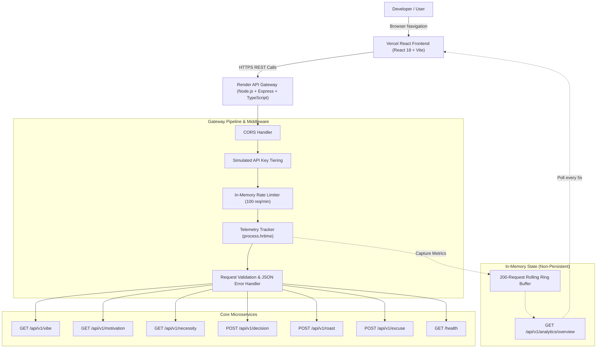

# നരകം EVIDEHHHH ? 🔥🎯
> **"നരകം എവിടെ? ഇവിടെ ഉണ്ട് API ആയിട്ട്!" — Infrastructure for problems nobody asked you to solve.**

[](https://tinkerhub.org/events/1M8ORET9A1/useless-projects-3.0)
[](https://opensource.org/licenses/MIT)
[](https://www.typescriptlang.org/)
[](https://reactjs.org/)
[](https://expressjs.com/)

---

## Basic Details
### Team Name: നരകം EVIDEHHHH ?

### Team Members
- Team Lead: Jiss Hajan - [ADD COLLEGE NAME] <!-- 🧑‍💻 HUMAN ACTION REQUIRED: Replace [ADD COLLEGE NAME] with your institution -->
- Member 2: [ADD TEAM MEMBER 2 NAME] - [ADD COLLEGE NAME] <!-- 🧑‍💻 HUMAN ACTION REQUIRED: Add teammate name & college if applicable -->
- Member 3: [ADD TEAM MEMBER 3 NAME] - [ADD COLLEGE NAME] <!-- 🧑‍💻 HUMAN ACTION REQUIRED: Add teammate name & college if applicable -->

### Project Description
നരകം EVIDEHHHH ? is an enterprise-grade cloud API platform engineered strictly for Malayalam developer satire and non-existent problems. It marries the visual insanity and existential despair of Malayalam cinema memes (Dasan & Vijayan, Innocent, Salim Kumar, Jagathy) with brutally serious developer infrastructure: real Express REST microservices, simulated API key tiers, an interactive playground, real-time in-memory telemetry, and live analytics.

### The Problem (that doesn't exist)
In the high-pressure world of software engineering, developers face absurd existential dilemmas:
- *Should I rewrite this stable production code in Rust at 3:00 AM?* ("ഇതൊക്കെ എന്ത്?")
- *Is this client meeting genuinely necessary, or could it have been an Innocent reaction sticker?*
- *Why did staging break when Mercury was in retrograde?* ("പണി പാളി!")
- *Who will ruthlessly roast my tech stack without corporate sugarcoating?*
- *Where is the chaos we were promised?* ("നരകം എവിടെ?")

Until now, zero enterprise cloud providers offered high-availability microservices to answer these pressing non-issues.

### The Solution (that nobody asked for)
നരകം EVIDEHHHH ? delivers six hyper-engineered, low-latency microservices with zero external database dependencies:
1. **Decision Engine (`POST /api/v1/decision`)**: Deterministic binary decision-making with mathematically overengineered justifications.
2. **Vibe Oracle (`GET /api/v1/vibe`)**: Developer energy & cosmos diagnostics with chaos indices.
3. **Existential Motivation (`GET /api/v1/motivation`)**: Counter-productive, unhelpful Malayalam-flavored productivity wisdom.
4. **Necessity Calculator (`GET /api/v1/necessity`)**: Scientific evaluation of whether a project or meeting is superfluous.
5. **Tech Stack Roaster (`POST /api/v1/roast`)**: Brutal, algorithmic architectural critiques.
6. **Enterprise Excuse Generator (`POST /api/v1/excuse`)**: Corporate and technical scapegoats for production disasters.

Targeting TinkerHub's *"Most Over-Engineered Solution to a Non-Problem"* side quest, നരകം EVIDEHHHH ? achieves comedic contrast: loud Mallu meme culture on the outside × high-availability developer infrastructure on the inside.

---

## Technical Details
### Technologies/Components Used
For Software:
- **Languages used**: TypeScript (ES2022) for strict end-to-end type safety across client and server.
- **Frameworks used**: Express.js (backend HTTP REST gateway), React 18 with Vite (frontend client).
- **Libraries used**: Tailwind CSS (dark developer UI), Lucide React (feather-style developer icons), React Router v6 (client-side routing).
- **Tools used**: `tsx` (TypeScript Node runtime), Git, npm, Vercel SPA routing (`vercel.json`), Render cloud deployment (`render.yaml`).
- **Data & State**: 100% in-memory telemetry ring buffer (sliding window of 200 requests, resets on process restart), per-IP rate-limiting bucket (100 req/min), simulated API key tiering (`enterprise`, `pro`, `hobbyist`, `guest`), zero external database or Redis required.

For Hardware:
- *N/A (Pure Software / Web & Cloud API Gateway)*

---

## Features
- **6 Intentionally Useless Microservices**: Real GET and POST endpoints returning structured JSON.
- **Interactive API Playground**: In-browser client to parameterize, execute requests, and inspect headers/payloads.
- **Dynamic cURL Generator**: One-click executable cURL commands reflecting the active target base URL and parameters.
- **Live Telemetry Ring Buffer**: In-memory sliding log buffer recording latency, status codes, methods, and IP addresses.
- **Real-Time Analytics Dashboard**: Visual distribution charts and auto-refreshing live telemetry stream (polled every 5s).
- **Rate Limiting & Tiers**: In-memory rate-limiter (100 req/min) and simulated API key authentication (`X-API-Key`).
- **Zero Database Complexity**: Self-contained architecture with zero external database, Redis, or cloud cache overhead.
- **Cloud Hosted**: Continuous deployment with React SPA routing on Vercel and Node API gateway on Render.

---

## Implementation
### Architecture Overview


### Installation
```bash
# Clone the repository
git clone https://github.com/jisssz/hell-yeah-useless-api.git
cd hell-yeah-useless-api

# Install backend dependencies
cd server
npm install

# Install frontend dependencies
cd ../client
npm install
```

### Run Locally
```bash
# 1. Start the Backend Gateway (from server/)
cd server
npm run dev
# Server listens on http://localhost:3001

# 2. In a separate terminal, start the Frontend (from client/)
cd client
npm run dev
# Frontend dev server opens at http://localhost:5173
```

### Production Build
```bash
# Build backend TypeScript
cd server
npm run build
npm start

# Build frontend production bundle
cd ../client
npm run build
npm run preview
```

---

## API Catalog & Reference
All endpoints return standard JSON responses with telemetry headers: `X-Request-Id`, `X-Response-Time`, `X-RateLimit-Limit`, and `X-RateLimit-Remaining`.

| Method | Endpoint | Description | Sample Request Payload |
|---|---|---|---|
| `GET` | `/api/v1/vibe` | Developer energy & cosmos vibe reading | *None* |
| `GET` | `/api/v1/motivation` | Counter-productive motivational advice | *None* |
| `GET` | `/api/v1/necessity?thing=another%20todo%20app` | Necessity calculator & verdict | `?thing=another%20todo%20app` |
| `POST` | `/api/v1/decision` | Deterministic binary resolution | `{"question": "Should I refactor in Rust?"}` |
| `POST` | `/api/v1/roast` | Architectural & code roast | `{"text": "I will finish my project tonight."}` |
| `POST` | `/api/v1/excuse` | Corporate & engineering scapegoats | `{"situation": "broke production staging"}` |
| `GET` | `/api/v1/analytics/overview` | Global telemetry metrics & live logs | *None* |
| `GET` | `/health` | Service health status | *None* |

---

## Project Documentation
For Software:

### Screenshots (Add at least 3)

*Landing page showcasing enterprise design system, value propositions, and live metric preview.*
<!-- 🧑‍💻 HUMAN ACTION REQUIRED: Add real screenshot to docs/screenshots/landing.png or update URL -->


*Interactive Playground allowing real-time parameter tuning, cURL generation, and live execution.*
<!-- 🧑‍💻 HUMAN ACTION REQUIRED: Add real screenshot to docs/screenshots/playground.png or update URL -->


*Real-time analytics dashboard displaying traffic breakdown, latency spectrum, and in-memory event stream.*
<!-- 🧑‍💻 HUMAN ACTION REQUIRED: Add real screenshot to docs/screenshots/analytics.png or update URL -->

### Diagrams

*End-to-end request lifecycle: Client UI -> Express Middleware -> Ring Buffer Telemetry -> Microservice Execution.*
<!-- The mermaid diagram above renders natively on GitHub. To export as an image, save to docs/architecture.png -->

For Hardware:
*(N/A - Software API)*

---

## Project Demo
### Video
[ADD DEMO VIDEO LINK]
*A 2-minute walkthrough of the നരകം EVIDEHHHH ? developer portal, live API Playground, cURL integration, and real-time telemetry streaming.*
<!-- 🧑‍💻 HUMAN ACTION REQUIRED: Replace [ADD DEMO VIDEO LINK] with your actual video link (YouTube/Loom) -->

### Additional Demos & Live Links
- **Production Frontend**: [https://hell-yeah-useless-api.vercel.app](https://hell-yeah-useless-api.vercel.app)
- **Production API Playground**: [https://hell-yeah-useless-api.vercel.app/playground](https://hell-yeah-useless-api.vercel.app/playground)
- **Production Analytics Dashboard**: [https://hell-yeah-useless-api.vercel.app/analytics](https://hell-yeah-useless-api.vercel.app/analytics)
- **Production Backend URL**: [https://hell-yeah-useless-api.onrender.com](https://hell-yeah-useless-api.onrender.com)
- **Live Gateway Health**: [https://hell-yeah-useless-api.onrender.com/health](https://hell-yeah-useless-api.onrender.com/health)
- **Live Telemetry Stream**: [https://hell-yeah-useless-api.onrender.com/api/v1/analytics/overview](https://hell-yeah-useless-api.onrender.com/api/v1/analytics/overview)
- **GitHub Repository**: [https://github.com/jisssz/hell-yeah-useless-api](https://github.com/jisssz/hell-yeah-useless-api)

---

## Team Contributions
- **Jiss Hajan**: Full-stack architecture, Express API gateway, TypeScript implementation, React frontend, Interactive Playground, telemetry ring buffer, and documentation.
<!-- 🧑‍💻 HUMAN ACTION REQUIRED: Update team roles and contributions if collaborating with teammates -->

---
Made with ❤️ at TinkerHub Useless Projects 


