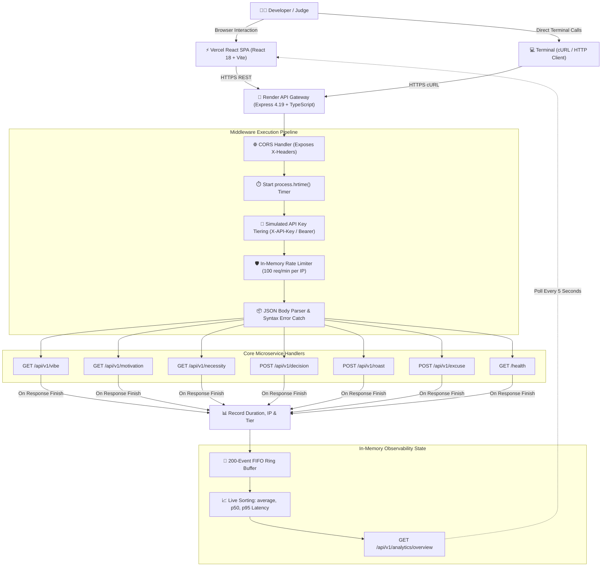

# നരകം EVIDEHHHH ? 🔥🎯

> **"നരകം എവിടെ? ഇവിടെ ഉണ്ട് API ആയിട്ട്!"**  
> *Production-grade cloud infrastructure for problems nobody asked anyone to solve.*

[](https://tinkerhub.org/events/1M8ORET9A1/useless-projects-3.0)
[](https://www.typescriptlang.org/)
[](https://reactjs.org/)
[](https://expressjs.com/)
[](https://tailwindcss.com/)
[](https://hell-yeah-useless-api.onrender.com/health)
[](https://hell-yeah-useless-api.vercel.app)

---

### 🌐 Quick Access & Verified Links
- 🚀 **Live Demo Platform**: [https://hell-yeah-useless-api.vercel.app](https://hell-yeah-useless-api.vercel.app)
- 🎮 **Interactive Playground**: [https://hell-yeah-useless-api.vercel.app/playground](https://hell-yeah-useless-api.vercel.app/playground)
- 📊 **Real-Time Telemetry Dashboard**: [https://hell-yeah-useless-api.vercel.app/analytics](https://hell-yeah-useless-api.vercel.app/analytics)
- 📖 **Interactive API Documentation**: [https://hell-yeah-useless-api.vercel.app/docs](https://hell-yeah-useless-api.vercel.app/docs)
- ⚙️ **Production REST Gateway**: [https://hell-yeah-useless-api.onrender.com](https://hell-yeah-useless-api.onrender.com)
- 📡 **Gateway Health Endpoint**: [https://hell-yeah-useless-api.onrender.com/health](https://hell-yeah-useless-api.onrender.com/health)
- 💻 **GitHub Repository**: [https://github.com/jisssz/hell-yeah-useless-api](https://github.com/jisssz/hell-yeah-useless-api)

---

## 2. What Is This? (The 30-Second Explanation)

**`നരകം EVIDEHHHH ?`** is a production-grade cloud API platform engineered strictly to solve problems that absolutely, unequivocally did not need cloud infrastructure.

Imagine a software engineer grappling with an absurd dilemma: *Should I rewrite this stable 20-line script in Rust at 3:00 AM?* Normal people flip a coin or ask a friend. Instead, we built an enterprise REST API gateway.

Then we added simulated API key tiers, per-IP rate limiting, high-resolution `process.hrtime()` telemetry, an in-memory 200-event ring buffer, percentile latency calculations (`p50` and `p95`), structured error envelopes, an interactive browser playground, dynamic cURL generation, a live analytics dashboard, and automated continuous deployment across Vercel and Render.

All of that architecture... simply to return `{"decision": "YES", "risk_level": "High"}` in 0.4 milliseconds.

*The comedy is the entry point. The engineering is the punchline. The Malayalam cinema meme culture is the personality. The production infrastructure is the unnecessary over-engineering.*

---

## 3. The Core Joke: The Problem Nobody Had

In modern developer culture, engineers over-complicate trivial human impulses with excessive technology. Here is how `നരകം EVIDEHHHH ?` responds to everyday non-problems:

| Completely Unnecessary Problem | Reasonable Human Response | Ridiculously Serious API Solution |
|---|---|---|
| **"Should I do this?"**<br>*(e.g., Deploying to prod on Friday)* | Flip a coin or trust intuition | `POST /api/v1/decision`<br>Deterministic binary resolution engine with biochemical entropy scoring and risk profiling. |
| **"What is my vibe?"**<br>*(e.g., Burned out at 2:00 AM)* | Drink a glass of water | `GET /api/v1/vibe`<br>Cosmic energy diagnostics evaluating quantum panic frequencies and unhinged recommendations. |
| **"Do I actually need this?"**<br>*(e.g., A 45-minute sprint standup)* | Mute your microphone and sigh | `GET /api/v1/necessity?thing=... `<br>Algorithmic necessity calculator calculating mathematical superfluity with peer-reviewed verdicts. |
| **"Give me motivation."**<br>*(e.g., Staring blankly at Jira tickets)* | Watch a motivational speech | `GET /api/v1/motivation`<br>Dispenses counter-productive existential Mallu advice designed to induce immediate productivity paralysis. |
| **"Roast my technology choices."**<br>*(e.g., Kubernetes for 2 active users)* | Read constructive PR feedback | `POST /api/v1/roast`<br>Algorithmic architectural roaster evaluating developer hubris with maximum severity classifications. |
| **"I need an excuse."**<br>*(e.g., Dropped the production database)* | Own up and apologize in Slack | `POST /api/v1/excuse`<br>Generates enterprise scapegoats calibrated by Agile Scrum Master believability percentages. |

---

## 4. Why "നരകം EVIDEHHHH ?"

The title **`നരകം EVIDEHHHH ?`** (*"Where is Hell?!"*) channels the iconic existential energy of golden-era Malayalam cinema and Kerala internet meme culture:

1. **The Question**: When modern developers face baffling codebases, broken staging environments, or 40-minute standups, their collective sentiment is identical to a classic Malayalam cinema reaction: *"നരകം എവിടെ? ഇവിടെ ഉണ്ട്!"*
2. **The Aesthetic**: Rather than building a sterile, corporate Silicon Valley developer portal, the platform is intentionally treated as a high-performance developer hub **infected by Malayalam meme culture**.
3. **The Repeated "HHHH"**: The intentional repeated "HHHH" reflects the chaotic, elongated vocal delivery typical of regional movie punchlines.
4. **Contextual UI Debris**: Instead of an isolated meme gallery, 9 die-cut Malayalam film cutouts (Salim Kumar, Jagathy, Innocent, Mammootty, Suraj, Lal, Mukesh) act as live, contextual reaction agents across the playground, documentation, terminal, and analytics.

---

## 5. What It Actually Does (Feature Overview)

Every feature listed below is fully implemented, verified, and running live in production:

### 🛠️ API Platform
- **Real REST API**: Six distinct microservice routes returning structured, typed JSON responses.
- **HTTP Method Diversity**: Native support for both `GET` (query parameters) and `POST` (JSON body parsing).
- **Request Body & Query Validation**: Strict checking of required fields (e.g. `question`, `text`, `situation`), returning RFC-compliant HTTP 400 envelopes on missing data.
- **Robust JSON Error Catcher**: Middleware catching malformed JSON payloads before reaching route handlers.
- **Predictable Error Taxonomy**: Standardized JSON error schema across all failure scenarios (`ROUTE_NOT_FOUND`, `RATE_LIMIT_EXCEEDED`, `MISSING_REQUIRED_BODY`, `MALFORMED_JSON`).

### 🛡️ Infrastructure & Middleware
- **Monotonic High-Precision Timing**: Microsecond-accurate duration tracking using Node.js `process.hrtime()`.
- **Sliding-Window Rate Limiting**: In-memory per-IP bucket (100 requests per 60-second window).
- **RFC-Compliant HTTP 429 Backoff**: Returns `Retry-After`, `X-RateLimit-Limit`, `X-RateLimit-Remaining`, and `X-RateLimit-Reset` headers.
- **Simulated Rate Limit Testing**: Built-in test header `X-Simulate-RateLimit: true` allowing instant verification of HTTP 429 handling without blasting 100 requests.
- **Simulated Multi-Tier Authentication**: Dynamic header inspection supporting both `X-API-Key` and `Authorization: Bearer <key>`.
- **Tier Propagation**: Automatically tags requests with `X-API-Tier` (`production-tier`, `developer-sandbox`, or `guest-open-access`).
- **Comprehensive CORS Support**: Preflight handling exposing all custom `X-*` headers to web clients and curl terminals.
- **Lightweight Health Check**: Dedicated `GET /health` endpoint returning service uptime and operational status.

### 📊 Observability & Telemetry
- **In-Memory Rolling Ring Buffer**: Capped 200-event FIFO log store recording request ID, timestamp, method, path, status code, IP, user-agent, API tier, and duration in milliseconds.
- **Real Percentile Engine**: Live mathematical sorting of request durations to calculate `averageLatencyMs`, `p50LatencyMs` (median), and `p95LatencyMs`.
- **Traffic & Status Distribution**: Aggregates requests by endpoint, HTTP method, and status code (200, 400, 404, 429, 500).
- **Global Uselessness Metric**: Algorithmic counter scaling dynamically with traffic volume, CPU cycles, and accumulated uselessness.
- **Live Stream**: Auto-polled stream in the frontend displaying the last 20 requests with microsecond timestamps.

### 💻 Developer Experience (DX)
- **Interactive Browser Playground**: Dual-panel testing console with parameter form controls, header configuration, and syntax-highlighted response viewers.
- **Dynamic cURL Generator**: Generates real-time, copy-pasteable terminal commands matching the user's inputs and selected environment.
- **Full API Documentation**: In-browser interactive manual detailing workflows, authentication, and error codes.
- **Deep Linking**: Direct URL query parameters (e.g. `/playground?api=decision`) pre-populating the playground for instant evaluation.

### 🎨 Frontend Design System
- **Single-Page Application**: React 18 + Vite 5 client with React Router v6.
- **Neo-Brutalist Visual Identity**: High-contrast dark theme (`#030712` canvas, `#ffe814` comic yellow accents, 3px solid black borders, and hard comic shadows).
- **Contextual Meme Reaction System**: 9 locally bundled PNG stickers with responsive positioning, speech bubbles, and keyframe float animations.
- **Motion Design**: 1.35s kinetic intro loader, scroll-triggered `IntersectionObserver` reveals, and full `prefers-reduced-motion` accessibility support.

---

## 6. API Catalog

All endpoints return JSON and expose telemetry headers: `X-Request-Id`, `X-Response-Time`, `X-API-Tier`, `X-RateLimit-Limit`, and `X-RateLimit-Remaining`.

| API Name | Method | Route | Purpose | Input Specification | Output Highlights |
|---|---|---|---|---|---|
| **Health Check** | `GET` | `/health` | Service liveness & gateway status | None | `{"status": "operational", "version": "1.0.0"}` |
| **Vibe Oracle** | `GET` | `/api/v1/vibe` | Quantum developer energy reading | None | `vibe`, `energy`, `chaos`, `recommendation` |
| **Existential Motivation** | `GET` | `/api/v1/motivation` | Counter-productive work advice | None | `quote`, `author`, `contextual_bad_advice` |
| **Necessity Calculator** | `GET` | `/api/v1/necessity` | Scientific project futility check | Query: `?thing=string` *(optional)* | `thing`, `necessity_score`, `verdict`, `reason` |
| **Decision Engine** | `POST` | `/api/v1/decision` | Deterministic binary resolution | Body: `{"question": "string"}` | `decision`, `confidence`, `risk_level` |
| **Tech Stack Roaster** | `POST` | `/api/v1/roast` | Algorithmic architectural roast | Body: `{"text": "string"}` | `input`, `roast`, `severity` |
| **Excuse Generator** | `POST` | `/api/v1/excuse` | Enterprise production scapegoats | Body: `{"situation": "string"}` | `situation`, `excuse`, `believability` |
| **Telemetry Overview** | `GET` | `/api/v1/analytics/overview` | Global metrics & rolling logs | None | `totalRequests`, `averageLatencyMs`, `p50LatencyMs`, `p95LatencyMs`, `recentLogs` |

---

## 7. Try It Yourself (Executable cURL Examples)

Judges can execute these copy-paste commands directly against the live production gateway (`https://hell-yeah-useless-api.onrender.com`):

### 1. Check Service Health
```bash
curl -i https://hell-yeah-useless-api.onrender.com/health
```

### 2. Request a Binary Decision (`POST`)
```bash
curl -i -X POST https://hell-yeah-useless-api.onrender.com/api/v1/decision \
  -H "Content-Type: application/json" \
  -d '{"question": "Should I deploy to production on Friday?"}'
```

### 3. Evaluate Project Necessity with Query Params (`GET`)
```bash
curl -i "https://hell-yeah-useless-api.onrender.com/api/v1/necessity?thing=rewriting%20everything%20in%20Rust"
```

### 4. Roast an Architectural Choice (`POST`)
```bash
curl -i -X POST https://hell-yeah-useless-api.onrender.com/api/v1/roast \
  -H "Content-Type: application/json" \
  -d '{"text": "We use Kubernetes microservices for our 3-page personal blog"}'
```

### 5. Generate a Production Excuse (`POST`)
```bash
curl -i -X POST https://hell-yeah-useless-api.onrender.com/api/v1/excuse \
  -H "Content-Type: application/json" \
  -d '{"situation": "dropped the staging database"}'
```

### 6. Read Developer Vibe (`GET`)
```bash
curl -i https://hell-yeah-useless-api.onrender.com/api/v1/vibe
```

### 7. Test Simulated Authentication Tiers (`X-API-Key`)
Pass an API key with `prod` or `live` in the string to observe `X-API-Tier: production-tier`:
```bash
curl -i https://hell-yeah-useless-api.onrender.com/api/v1/vibe \
  -H "X-API-Key: uk_live_production_key_42"
```

### 8. Test Rate Limiting Simulation (`HTTP 429`)
Pass `X-Simulate-RateLimit: true` to instantly inspect the rate limiter response without firing 100 requests:
```bash
curl -i https://hell-yeah-useless-api.onrender.com/api/v1/vibe \
  -H "X-Simulate-RateLimit: true"
```
*Response:*
```json
HTTP/2 429 Too Many Requests
retry-after: 60
x-ratelimit-remaining: 0

{
  "error": {
    "code": "RATE_LIMIT_EXCEEDED",
    "message": "Rate limit exceeded. Please calm down."
  }
}
```

### 9. Inspect Live In-Memory Telemetry
```bash
curl -i https://hell-yeah-useless-api.onrender.com/api/v1/analytics/overview
```

---

## 8. How We Over-Engineered Nothing

Most useless projects stop at a static website or a random text generator. We asked:  
*What if we treated complete nonsense with the architectural gravity of Stripe or AWS?*

| Ordinary Solution | Our Over-Engineered Solution | Unnecessary Engineering Behind It |
|---|---|---|
| Ask a coworker | `POST /api/v1/decision` | Express route handler, JSON body validator, biochemical risk scoring, monotonic duration tracking. |
| Check your mood | `GET /api/v1/vibe` | Quantum panic frequency calculator, chaos index generator, structured response headers. |
| Ignore a pointless task | `GET /api/v1/necessity` | Query param normalization, superfluity matrix evaluation, peer-reviewed mathematical verdicts. |
| Make up an excuse | `POST /api/v1/excuse` | Technical scapegoat generator, Agile believability metrics, payload error catching. |
| Roast your own code | `POST /api/v1/roast` | Architectural hubris analyzer, severity classification engine, strict typing. |
| Traffic spikes on useless APIs | In-Memory Sliding Limiter | Per-IP token bucket (100 req/min), standard RFC `Retry-After` headers, HTTP 429 backoff. |
| Performance monitoring | In-Memory Telemetry Engine | `process.hrtime()` nanosecond timing, 200-event FIFO ring buffer, live `p50` / `p95` latency sorting. |

*We could have written five plain functions. Instead, we engineered cloud infrastructure.*

---

## 9. Architecture

The system operates as a decoupled client-server architecture with an Express.js gateway and a Vite React SPA frontend:



---

## 10. Observability for Absolutely Nothing

Why does an API returning fake excuses need telemetry? It doesn't. That is why we built it.

- **Monotonic High-Precision Timing**: In [server/src/middleware/telemetry.ts](server/src/middleware/telemetry.ts), execution times are tracked using Node.js `process.hrtime()`. The resulting duration in milliseconds is appended directly to the HTTP response headers via `X-Response-Time`.
- **The 200-Event Rolling Ring Buffer**: Telemetry entries are stored in a fixed-size, in-memory array capped at 200 items (`maxLogs = 200`). When the buffer reaches capacity, the oldest logs are discarded, guaranteeing constant (O(1)) memory usage.
- **Live Latency Percentiles**: When `/api/v1/analytics/overview` is requested, the server dynamically sorts the rolling durations array and computes:
  - **Arithmetic Mean**: `averageLatencyMs = (totalDuration / total)`
  - **Median (`p50`)**: `durations[Math.floor(length * 0.5)]`
  - **95th Percentile (`p95`)**: `durations[Math.floor(length * 0.95)]`
- **Global Uselessness Scoring**: Computes a dynamic composite score scaled by total calls, CPU cycle time, and accumulated absurdity:
  $$\text{Global Uselessness} = \min(9999, 100 + (\text{total} \times 13) + \lfloor\text{totalDuration} \times 1.5\rfloor)$$

---

## 11. Enterprise-Grade Protection for an API Nobody Needs

Because apparently someone might attempt a distributed Denial-of-Service attack on an endpoint that tells them whether to eat biriyani.

In [server/src/middleware/rateLimit.ts](server/src/middleware/rateLimit.ts):
- **Mechanism**: In-memory per-IP sliding window tracking timestamps in a `Map<string, RateLimitBucket>`.
- **Threshold**: **100 requests per 60-second window** per client IP.
- **Headers Emitted**:
  - `X-RateLimit-Limit: 100`
  - `X-RateLimit-Remaining: <count>`
  - `X-RateLimit-Reset: <seconds-to-window-reset>`
- **Exceeded Behavior**: If a client exceeds 100 requests in 60 seconds (or provides `X-Simulate-RateLimit: true`), the gateway immediately halts execution, attaches `Retry-After: <seconds>`, and returns:
  ```json
  HTTP/2 429 Too Many Requests
  {
    "error": {
      "code": "RATE_LIMIT_EXCEEDED",
      "message": "Rate limit exceeded. Please calm down."
    }
  }
  ```

---

## 12. Simulated Authentication & API Key Tiers

The platform does not lock endpoints behind real paywalls or commercial billing databases. Instead, [server/src/middleware/apiKey.ts](server/src/middleware/apiKey.ts) simulates enterprise SaaS tiering:

- **Supported Headers**: `X-API-Key: <key>` or `Authorization: Bearer <key>`.
- **Implemented Tiers**:
  1. **`production-tier`**: Activated if the key contains `live`, `prod`, or begins with `uk_live_`.
  2. **`developer-sandbox`**: Activated if the key contains `test`, `sandbox`, `dev`, `uk_dev_`, or any other custom string.
  3. **`guest-open-access`**: Default assigned to all public unauthenticated requests.
- **Propagation**: The evaluated tier is injected into the response header (`X-API-Tier`) and logged in the telemetry stream for real-time traffic breakdown.

---

## 13. The Frontend Experience

The user interface is styled as a high-tech developer control room that was thoroughly colonized by Malayalam cinema memes:

- **Neo-Brutalist Comic System**: Solid 3px black borders, high-contrast dark background (`#030712`), vivid comic yellow (`#ffe814`), and comic drop shadows (`.shadow-comic`).
- **Contextual Meme Reactions (9 Local Die-Cut PNGs)**:
  - `salimkumar-pointing.png` (Salim Kumar pointing finger — *"ITHAANU SAADHANAM!"*)
  - `jagathy-shocked.png` (Jagathy bulging shocked eyes — *"ENTHINU?!"*)
  - `suraj-laughing.png` (Suraj laughing hysterically — *"ITH ENTH VIBE?!"*)
  - `innocent-serious.png` (Innocent deadpan look — *"VAAYICHITTU PANI!"*)
  - `mammootty-crying.png` (Mammootty tragic face — *"AYYO KUDUMBAM!"*)
  - `lal-laughing.png` (Lal laughing with beard — *"SHUBHAM!"*)
  - `salimkumar-class.png` (Salim Kumar existential dread — *"ANTHYAMILLE?!"*)
  - `mammootty-narakam.png` (Official mascot avatar)
  - `mukesh-laugh.png` (Mukesh smirking — *"KOLLAM SPECIAL!"*)
- **Zero Third-Party Image CDNs**: All 9 assets are bundled locally in `client/public/assets/memes/` (total weight: **~259 KB**).
- **Interactive Playground**: Execute any microservice directly in the browser with parameter controls, simulated header toggles, and live response views.
- **Analytics Control Room**: Visual telemetry dashboard with distribution graphs and auto-refreshing live log streams polled every 5 seconds.

---

## 14. Motion Design & Kinetic Interaction

- **Session Intro Loader**: A 1.35s choreographed entry animation featuring the Mammootty mascot avatar, kinetic Malayalam typography (`നരകം`), and retro status indicators.
- **Kinetic Floating Stickers**: Smooth CSS keyframe floaters (`animate-float-y`, `animate-float-slow`, `animate-pulse-scale`) that breathe life into reaction stickers without blocking clicks (`pointer-events-none`).
- **Scroll-Reveal System**: Monitored via a global `IntersectionObserver` triggering `.revealed` transitions as the user navigates down the page.
- **Reduced-Motion Accessibility**: Fully compliant with `@media (prefers-reduced-motion: reduce)`, disabling all keyframes and translation transforms for sensitive users.

---

## 15. Cross-Disciplinary Approach (60% / 20% / 20% Evaluation)

`നരകം EVIDEHHHH ?` deliberately synthesizes multiple disciplines:

### 1. Creativity (60% Weight)
- **Subversion of Developer Culture**: Takes serious SaaS tropes (SLAs, API tiers, Swagger documentation, status pages) and turns them into comedic instruments.
- **Malayalam Cinema Pop-Culture Integration**: Captures authentic Kerala cinema comedic timing and dialogue, seamlessly marrying regional film nostalgia with modern tech humor.
- **The Over-Engineering Meta-Joke**: The humor does not rely on random placeholder text; the punchline is the sheer amount of genuine engineering applied to a non-problem.

### 2. Implementation Complexity (20% Weight)
- **Full TypeScript Architecture**: End-to-end type safety across client and server.
- **Low-Level Microsecond Telemetry**: High-precision monotonic duration tracking using Node's `process.hrtime()`.
- **Statistical Percentile Engine**: Live array sorting computing `p50` and `p95` latency distributions in real-time.
- **Sliding-Window Token Bucket**: Custom memory-bounded rate limiter returning RFC-compliant HTTP 429 headers.
- **Zero-Dependency In-Memory Ring Buffer**: Custom FIFO store maintaining (O(1)) memory bounds.

### 3. Cross-Disciplinary Synthesis (20% Weight)
- **Backend Systems**: REST design, middleware pipelines, header exposure, status codes.
- **SRE & Observability**: Latency percentiles, error rate tracking, health monitors.
- **Product & UX Design**: Interactive API playground, real-time cURL generation, documentation.
- **Visual & Motion Design**: Neo-brutalist dark comic aesthetic, kinetic typography, CSS keyframe choreography.
- **Regional Cultural Linguistics**: Colloquial Malayalam expressions accurately set against corporate tech jargon.

---

## 16. Tech Stack

| Domain | Technology | Version | Purpose / Evidence |
|---|---|---|---|
| **Frontend Framework** | React | 18.3.1 | Core UI component architecture (`client/package.json`) |
| **Frontend Tooling** | Vite | 5.3.1 | Fast build tool & HMR dev server (`client/package.json`) |
| **Language (Frontend)** | TypeScript | 5.5.2 | Strict type contracts for client components |
| **Styling** | Tailwind CSS | 3.4.4 | Neo-brutalist styling & custom comic utilities |
| **Routing** | React Router | 6.24.1 | Client-side routing with deep-link support |
| **Icons** | Lucide React | 0.395.0 | Developer iconography |
| **Backend Framework** | Express.js | 4.19.2 | Minimalist HTTP REST gateway (`server/package.json`) |
| **Language (Backend)** | TypeScript | 5.5.2 | Strict typed request/response models |
| **Runtime Tooling** | tsx | 4.16.2 | High-speed TypeScript Node runtime for development |
| **CORS Middleware** | cors | 2.8.5 | Cross-Origin Resource Sharing with header exposure |
| **Timing Mechanism** | `process.hrtime` | Native | Nanosecond-resolution monotonic execution timing |
| **Deployment (Client)** | Vercel | Edge | Production React SPA hosting with SPA rewrites |
| **Deployment (Server)** | Render | Web Service | Cloud Node.js API gateway hosting |

---

## 17. Project Structure

```
hell-yeah-useless-api/
├── client/                     # React 18 + Vite 5 Frontend
│   ├── public/
│   │   └── assets/
│   │       ├── memes/          # 9 local die-cut Malayalam meme sticker PNGs
│   │       └── narakam-logo.png# Official Mammootty mascot avatar
│   ├── src/
│   │   ├── components/         # Reusable UI components (MemeSticker, Navbar, etc.)
│   │   ├── data/               # Client-side API catalog & metadata
│   │   ├── pages/              # Landing, Catalog, Detail, Playground, Analytics, Docs
│   │   ├── services/           # apiClient with live endpoint configuration
│   │   ├── App.tsx             # Root routing, intro loader & scroll observer
│   │   ├── index.css           # Custom comic drop shadows & font imports
│   │   └── main.tsx            # React application entry point
│   ├── package.json            # Client dependencies & scripts
│   └── vite.config.ts          # Vite configuration
│
├── server/                     # Node.js + Express + TypeScript Backend
│   ├── src/
│   │   ├── data/               # Curated satirical datasets (decisions, vibes, roasts)
│   │   ├── middleware/         # Telemetry (ring buffer), apiKey, rateLimit
│   │   │   ├── apiKey.ts       # Simulated authentication tiering
│   │   │   ├── rateLimit.ts    # Sliding window per-IP rate limiter
│   │   │   └── telemetry.ts    # 200-event ring buffer & p50/p95 percentile engine
│   │   ├── routes/             # 6 satirical microservice routes + analytics
│   │   │   ├── analytics.ts    # Telemetry overview endpoint
│   │   │   ├── decision.ts     # POST /api/v1/decision
│   │   │   ├── excuse.ts       # POST /api/v1/excuse
│   │   │   ├── motivation.ts   # GET /api/v1/motivation
│   │   │   ├── necessity.ts    # GET /api/v1/necessity
│   │   │   ├── roast.ts        # POST /api/v1/roast
│   │   │   └── vibe.ts         # GET /api/v1/vibe
│   │   ├── utils/              # Standardized JSON response helpers
│   │   └── index.ts            # Server bootstrap, middleware pipeline & /health
│   ├── package.json            # Server dependencies & scripts
│   └── tsconfig.json           # Server TypeScript configuration
│
├── docs/                       # Screenshots & architecture diagrams
├── render.yaml                 # Render cloud deployment specification
├── vercel.json                 # Vercel SPA routing configuration
└── README.md                   # This competition submission document
```

---

## 18. Local Development Guide

### Prerequisites
- **Node.js**: v18.0.0 or higher
- **npm**: v9.0.0 or higher

### 1. Clone the Repository
```bash
git clone https://github.com/jisssz/hell-yeah-useless-api.git
cd hell-yeah-useless-api
```

### 2. Install Dependencies
```bash
# Install backend dependencies
cd server
npm install

# Install frontend dependencies
cd ../client
npm install
```

### 3. Start Local Development Servers
In terminal 1 (Backend Gateway):
```bash
cd server
npm run dev
# Server listens on http://localhost:3001
```

In terminal 2 (Frontend Client):
```bash
cd client
npm run dev
# Frontend opens at http://localhost:5173
```

### 4. Build Verification
```bash
# Verify backend TypeScript compilation
cd server
npm run build

# Verify frontend production bundle
cd ../client
npm run build
```

---

## 19. Production Deployment

The project is continuously deployed to production on cloud infrastructure:

- **Frontend Client**: Hosted on **Vercel** with global edge CDN distribution, automatic HTTPS, and custom SPA rewrite rules defined in `vercel.json`.
  - **Live URL**: [https://hell-yeah-useless-api.vercel.app](https://hell-yeah-useless-api.vercel.app)
- **Backend Gateway**: Hosted on **Render** as a Node.js web service running compiled TypeScript.
  - **Live URL**: [https://hell-yeah-useless-api.onrender.com](https://hell-yeah-useless-api.onrender.com)
  - **Uptime / Health**: [https://hell-yeah-useless-api.onrender.com/health](https://hell-yeah-useless-api.onrender.com/health)

---

## 20. Performance & Architecture Decisions

1. **In-Memory Ring Buffer Over External Databases**: Instead of introducing PostgreSQL, Redis, or Mongo for telemetry, the server implements an in-memory rolling buffer capped at 200 items. This eliminates database cold starts, external network latency, connection pooling bugs, and hosting costs.
2. **Nanosecond Native Timing**: Duration measurements use Node's built-in `process.hrtime()`, avoiding heavy third-party APM agents (Datadog, New Relic) while achieving microsecond precision.
3. **Local Asset Bundling**: All 9 meme cutouts are optimized PNG files stored in `client/public/assets/memes/` (~259 KB total). The frontend never relies on third-party image hosts or CDNs that could break during judging.
4. **Lightweight Bundle Footprint**: The entire frontend compiles down to a lean **303 kB JS** bundle and **63 kB CSS** file, ensuring instantaneous page loads even on constrained connections.

---

## 21. What This Is NOT (Honest Limitations)

In the spirit of technical credibility:
- **NOT an AI/LLM wrapper**: The APIs do not make external calls to OpenAI, Claude, or Gemini. Responses are computed deterministically or sampled from handcrafted satirical datasets with algorithmic metadata.
- **NOT a commercial auth platform**: The API key tiers (`production-tier`, `developer-sandbox`, `guest-open-access`) are simulated in middleware for demonstration and developer experience purposes; no credit cards or real user databases exist.
- **NOT persistent across server reboots**: The 200-event telemetry ring buffer and per-IP rate limit buckets live strictly in memory. When the server process restarts on Render, logs reset to zero.
- **NOT a useful product**: It will not solve your business problems, optimize your sprint velocity, or improve your code quality. It is 100% intentionally useless.

---

## 22. Why We Built It

> We wanted to answer one ridiculous question:  
> **"What happens if you treat a completely useless problem with the architectural seriousness of mission-critical cloud infrastructure?"**  
>  
> Apparently, this happens.

We built **`നരകം EVIDEHHHH ?`** for TinkerHub's Useless Projects 3.0 to explore the hilarious boundary where software engineering over-complication collides with regional internet comedy. It celebrates the sheer joy of coding something for no practical reason other than to make developers laugh and admire the architecture.

---

## 23. Why This Belongs at Useless Projects 3.0

- **Creativity**: Rather than building another novelty button or meme generator, we created a complete enterprise developer platform with rate limiting, telemetry, and Swagger-style docs for entirely useless non-problems.
- **Implementation Complexity**: Real Express REST microservices, TypeScript interfaces, `process.hrtime` duration tracking, a rolling 200-request ring buffer, and live `p50` / `p95` latency calculation.
- **Cross-Disciplinary Execution**: Merges distributed API design, site reliability telemetry, interactive UI/UX, CSS keyframe motion choreography, and authentic Kerala cinema meme culture.

---

## 24. Team Details

### Team Name: നരകം EVIDEHHHH ?

### Team Members
- **Team Lead**: Jiss Hajan - [ADD COLLEGE NAME] <!-- 🧑‍💻 HUMAN ACTION REQUIRED: Replace [ADD COLLEGE NAME] with your institution -->
- **Member 2**: [ADD TEAM MEMBER 2 NAME] - [ADD COLLEGE NAME] <!-- 🧑‍💻 HUMAN ACTION REQUIRED: Add teammate name & college if applicable -->
- **Member 3**: [ADD TEAM MEMBER 3 NAME] - [ADD COLLEGE NAME] <!-- 🧑‍💻 HUMAN ACTION REQUIRED: Add teammate name & college if applicable -->

---

## 25. Project Demo

### Video Walkthrough
[ADD DEMO VIDEO LINK]  
*A 2-minute walkthrough of the നരകം EVIDEHHHH ? developer portal, live API Playground, cURL integration, and real-time telemetry streaming.*  
<!-- 🧑‍💻 HUMAN ACTION REQUIRED: Replace [ADD DEMO VIDEO LINK] with your actual YouTube or Loom link -->

### Live Links
- **Production Web Application**: [https://hell-yeah-useless-api.vercel.app](https://hell-yeah-useless-api.vercel.app)
- **Production API Playground**: [https://hell-yeah-useless-api.vercel.app/playground](https://hell-yeah-useless-api.vercel.app/playground)
- **Production Analytics Dashboard**: [https://hell-yeah-useless-api.vercel.app/analytics](https://hell-yeah-useless-api.vercel.app/analytics)
- **Production Backend Gateway**: [https://hell-yeah-useless-api.onrender.com](https://hell-yeah-useless-api.onrender.com)
- **GitHub Repository**: [https://github.com/jisssz/hell-yeah-useless-api](https://github.com/jisssz/hell-yeah-useless-api)

---

## 26. Final Closing

> **Built with TypeScript, questionable architectural ambition, pure Malayalam cinema energy, and absolutely zero reason to exist.**  
>  
> *THE PROBLEM IS USELESS. THE INFRASTRUCTURE IS REAL. THE MEMES ARE EVERYWHERE. THE ENGINEERING IS THE PUNCHLINE.*

---

Made with ❤️ for TinkerHub Useless Projects 3.0

[](https://www.tinkerhub.org/)
[](https://tinkerhub.org/events/1M8ORET9A1/useless-projects-3.0)
