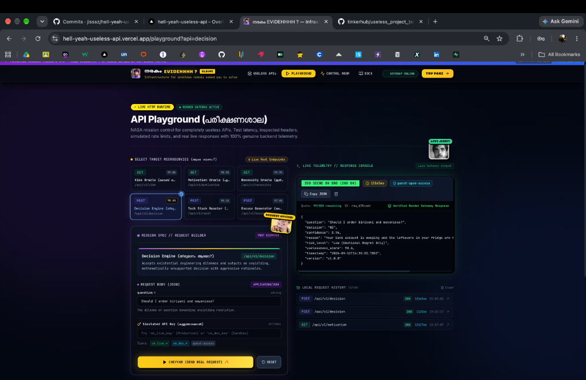
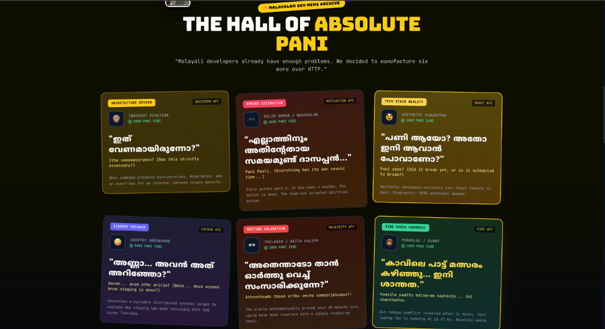

# നരകം EVIDEHHHH ?

## Basic Details

### Team Name
HELL YEAH

### Team Members
- Team Lead: Jis Shajan - Christ College of Engineering, Irinjalakuda
- Member 2: Angelin Gino - Christ College of Engineering, Irinjalakuda

### Project Description

**`നരകം EVIDEHHHH ?`** (*"Where is Hell?!"*) is a production-grade developer platform and REST API gateway engineered with utmost technical seriousness to solve problems that absolutely, unequivocally did not need an API.

Modern software developers frequently suffer from computational hubris: taking ordinary human impulses—deciding what to eat, seeking motivation, diagnosing burnout, or inventing an excuse for an outage—and convincing themselves that an API should handle it. Rather than fighting this instinct, we leaned entirely into it. We built an enterprise-ready microservice infrastructure complete with RFC-compliant rate limiting, simulated API key tiers, nanosecond-precision telemetry, an in-memory rolling ring buffer, live statistical percentile sorting (`p50`/`p95`), structured JSON error envelopes, and an interactive developer playground.

The central joke of the platform is the staggering contrast between the futility of the problems and the architectural gravity applied to them. When a developer queries `POST /api/v1/decision` at 3:00 AM asking *"Should I rewrite this working script in Rust?"*, the request traverses high-resolution timers, per-IP token buckets, and simulated authentication tiers—just to return `{"decision": "YES", "risk_level": "High"}` in 0.4 milliseconds.

The entire product experience is delivered through a high-contrast neo-brutalist interface infused with golden-era Malayalam cinema meme culture. Contextual die-cut reaction stickers (Salim Kumar, Jagathy, Innocent, Mammootty, Suraj, Lal, Mukesh) react dynamically to your API responses, transforming mundane developer tooling into an unapologetic celebration of Kerala internet humor.

### The Problem (that doesn't exist)

Across engineering teams, developers repeatedly manufacture catastrophic non-problems that could be resolved with five seconds of human reflection:

1. **The Binary Decision Dilemma**: Software engineers who cannot choose between ordering biriyani or deploying to production on a Friday without consulting an HTTP endpoint.
2. **Artificial Existential Motivation**: Programmers staring blankly at Jira sprints, desperate for machine-dispensed, counter-productive Mallu advice to justify productive procrastination.
3. **The Algorithmic Superfluity Crisis**: Teams needing an academic, mathematical evaluation to determine whether an item or meeting (e.g. *"another 45-minute daily standup"*) is fundamentally unnecessary.
4. **Programmatic Architectural Roasting**: Developers who need their infrastructure choices (e.g. *"Kubernetes for a static 2-page blog"*) publicly and mercilessly roasted via a `POST` request.
5. **Automated Production Scapegoats**: Engineers who dropped the staging database and require enterprise-grade, Agile-compliant excuses with calibrated believability scores.
6. **Quantum Vibe Diagnostics**: Exhausted developers demanding cosmic energy readings, chaos indices, and unhinged deployment recommendations over HTTP `GET`.

None of these problems required a cloud API. A coin flip, a cup of tea, or a deep breath would have solved every single one.

### The Solution (that nobody asked for)

Instead of a sensible human response, we built a fully operational cloud API infrastructure that treats each non-problem with the architectural discipline of Stripe or AWS:

$$\text{Completely Useless Dilemma} \longrightarrow \text{Real HTTP REST Call} \longrightarrow \text{Backend Middleware Pipeline} \longrightarrow \text{Nanosecond Telemetry} \longrightarrow \text{Structured JSON Response} \longrightarrow \text{Live Observability Ring Buffer}$$

- **6 Satirical Microservices**: Dedicated REST endpoints returning deterministic calculations, risk profiles, and satirical payloads wrapped in strict JSON schemas.
- **In-Memory Sliding Rate Limiter**: 100 requests per 60-second window per client IP, emitting RFC-compliant `X-RateLimit-*` and `Retry-After` headers.
- **Simulated Authentication Tiers**: Header inspection recognizing `production-tier`, `developer-sandbox`, and `guest-open-access` without requiring commercial paywalls.
- **Microsecond Observability**: Built-in `process.hrtime()` duration monitoring feeding a capped 200-event in-memory ring buffer with dynamic `p50` and `p95` percentile calculations.
- **Interactive Developer Playground**: Dual-panel browser workbench with live parameter builder, cURL generator, raw JSON viewers, latency badges, and request history.
- **Malayalam Pop-Culture Visual System**: Kinetic, responsive frontend styled with neo-brutalist comic shadows, glowing card aesthetics, mission-control radar displays, and 9 local die-cut Malayalam actor reaction stickers.

## Technical Details

### Technologies/Components Used

For Software:

- **Languages used**:
  - **TypeScript 5.5.2**: End-to-end type safety across both frontend and backend codebases (`strict: true`).
  - **HTML5 & CSS3**: Semantic layouts, custom CSS keyframe choreography, and neo-brutalist styling.
- **Frameworks used**:
  - **React 18.3.1**: Component-driven client architecture with hooks and memoized state (`client/package.json`).
  - **Express.js 4.19.2**: High-throughput Node.js REST API gateway (`server/package.json`).
- **Libraries used**:
  - **Tailwind CSS 3.4.4**: Utility-first styling with custom comic shadows, glow utilities, and CSS keyframes.
  - **React Router DOM 6.24.1**: Client-side routing with deep linking support (`/playground?api=decision`).
  - **Lucide React 0.395.0**: Developer and telemetry iconography.
  - **cors 2.8.5**: Cross-Origin Resource Sharing middleware exposing custom `X-*` headers.
- **Tools used**:
  - **Vite 5.3.1**: Next-generation frontend build tooling and local HMR dev server.
  - **tsx 4.16.2**: TypeScript Node runtime for rapid server execution without separate transpile steps.
  - **Node.js `process.hrtime`**: Monotonic, high-resolution execution timing down to nanoseconds.
  - **Git & GitHub**: Distributed version control and source code management.
  - **Vercel**: Edge cloud platform hosting the production React SPA with automated SPA routing rewrites.
  - **Render**: Cloud web service hosting the production Express TypeScript backend gateway.

### Implementation

For Software:

The project is structured as a decoupled client-server architecture:

1. **Frontend Architecture (`client/`)**:
   - Built with React 18 and Vite.
   - Houses the **Interactive Playground** with real-time cURL command generation, dynamic parameter/body form generation, status pill badges, latency monitors, and local request history.
   - Provides an **Observability Control Room** that polls the backend telemetry ring buffer every 5 seconds to visualize request distribution, status breakdown, and rolling logs.
   - Incorporates a **Neo-Brutalist Design System** with custom comic shadows, radar sweep keyframes, and 9 locally bundled die-cut Malayalam meme sticker PNGs (`~259 KB` total, zero external image CDNs).

2. **Backend Gateway Architecture (`server/`)**:
   - Built with Express and TypeScript.
   - Incoming requests pass through a sequential middleware pipeline:
     - **CORS Handling**: Exposes `X-Request-Id`, `X-Response-Time`, `X-API-Tier`, and `X-RateLimit-*` headers to browser clients.
     - **Monotonic High-Precision Timing**: Captures request arrival with `process.hrtime()`.
     - **Simulated Tier Detection**: Inspects `X-API-Key` / `Authorization: Bearer` and assigns `production-tier`, `developer-sandbox`, or `guest-open-access`.
     - **Sliding Window Rate Limiter**: Enforces a 100 req/min per-IP cap and handles `X-Simulate-RateLimit: true` for instant testing.
     - **JSON Body Parser & Error Envelopes**: Strict JSON parsing with unified error formatting on invalid inputs.
   - Route handlers execute the requested satire microservice and record execution metadata (`durationMs`, `status`, `method`, `path`, `ip`, `apiKeyTier`) into a **200-event in-memory rolling ring buffer**.
   - The ring buffer dynamically computes arithmetic mean, `p50` median, and `p95` latency percentiles on demand.

#### Core API Endpoints

| Method | Endpoint | Description | Sample Request |
| :---: | :--- | :--- | :--- |
| `GET` | `/health` | Gateway liveness & uptime check | `curl -i https://hell-yeah-useless-api.onrender.com/health` |
| `GET` | `/api/v1/vibe` | Quantum developer vibe & chaos level | `curl -i https://hell-yeah-useless-api.onrender.com/api/v1/vibe` |
| `GET` | `/api/v1/motivation` | Counter-productive workplace motivation | `curl -i https://hell-yeah-useless-api.onrender.com/api/v1/motivation` |
| `GET` | `/api/v1/necessity` | Algorithmic project superfluity check | `curl -i "https://hell-yeah-useless-api.onrender.com/api/v1/necessity?thing=rewriting%20in%20Rust"` |
| `POST` | `/api/v1/decision` | Deterministic binary resolution engine | `curl -i -X POST https://hell-yeah-useless-api.onrender.com/api/v1/decision -H "Content-Type: application/json" -d '{"question":"Deploy Friday?"}'` |
| `POST` | `/api/v1/roast` | Algorithmic tech stack roaster | `curl -i -X POST https://hell-yeah-useless-api.onrender.com/api/v1/roast -H "Content-Type: application/json" -d '{"text":"Kubernetes for 3 users"}'` |
| `POST` | `/api/v1/excuse` | Enterprise production scapegoat generator | `curl -i -X POST https://hell-yeah-useless-api.onrender.com/api/v1/excuse -H "Content-Type: application/json" -d '{"situation":"dropped DB"}'` |
| `GET` | `/api/v1/analytics/overview` | Live telemetry & percentile distribution | `curl -i https://hell-yeah-useless-api.onrender.com/api/v1/analytics/overview` |

# Installation

### Prerequisites
- **Node.js**: v18.0.0 or higher
- **npm**: v9.0.0 or higher
- **Git**: Installed and configured

### 1. Clone the Repository
```bash
git clone https://github.com/jisssz/hell-yeah-useless-api.git
cd hell-yeah-useless-api
```

### 2. Install Server Dependencies
```bash
cd server
npm install
```

### 3. Install Client Dependencies
```bash
cd ../client
npm install
```

# Run

To run the full stack locally with hot module replacement, start both backend and frontend in separate terminal windows:

### Terminal 1: Start the Backend Gateway (Port 3001)
```bash
cd server
npm run dev
```
*The Express API gateway starts on `http://localhost:3001`.*

### Terminal 2: Start the Frontend Client (Port 5173)
```bash
cd client
npm run dev
```
*The Vite development server opens on `http://localhost:5173`.*

### Build for Production Verification
```bash
# Verify backend TypeScript compilation
cd server
npm run build

# Verify frontend production bundle
cd ../client
npm run build
```

### Project Documentation

For Software:

# Screenshots (Add at least 3)

### 1. Landing Page & Malayalam Meme Visual Identity

*Figure 1: Production landing page displaying the kinetic hero section, rotating existential developer quotes, official mascot avatar, executable cURL terminal box, and contextual Malayalam meme reaction stickers.*

### 2. Interactive API Playground & Live Response Console

*Figure 2: The interactive developer playground at `/playground` demonstrating target microservice selection (`/api/v1/decision`), parameter configuration, verified Render gateway response, and live local request history.*

### 3. Malayalam Dev Meme Archive: The Hall of Absolute Pani

*Figure 3: The Hall of Absolute Pani showing curated regional cinema reaction cards with dialogue excerpts corresponding to each of the six satirical microservices.*

# Diagrams

```mermaid
flowchart TD
    User["👨‍💻 Developer / Judge"]
    Browser["⚡ Vercel React SPA (React 18 + Vite)"]
    Terminal["💻 Terminal (cURL / HTTP Client)"]
    Gateway["🚀 Render API Gateway (Express 4.19 + TypeScript)"]
    
    subgraph "Middleware Execution Pipeline"
        CORS["🌐 CORS Handler (Exposes X-Headers)"]
        TelemetryPre["⏱️ High-Precision Monotonic Timer (process.hrtime)"]
        Auth["🔑 Simulated API Tiering (X-API-Key / Bearer)"]
        Limiter["🛡️ In-Memory Sliding Limiter (100 req/min per IP)"]
        Parser["📦 JSON Body Parser & Error Envelopes"]
    end

    subgraph "Core Satirical Microservices"
        H1["GET /api/v1/vibe"]
        H2["GET /api/v1/motivation"]
        H3["GET /api/v1/necessity"]
        H4["POST /api/v1/decision"]
        H5["POST /api/v1/roast"]
        H6["POST /api/v1/excuse"]
        H7["GET /health"]
    end

    subgraph "In-Memory Observability Ring Buffer"
        RingBuffer["🔄 200-Event FIFO Ring Buffer"]
        PercentileEngine["📈 Live Sorting: Mean, p50, p95 Latency"]
        AnalyticsRoute["GET /api/v1/analytics/overview"]
    end

    User -->|Browser UI / Playground| Browser
    User -->|Direct HTTP Requests| Terminal
    Browser -->|REST API Calls| Gateway
    Terminal -->|cURL Commands| Gateway
    
    Gateway --> CORS --> TelemetryPre --> Auth --> Limiter --> Parser
    Parser --> H1 & H2 & H3 & H4 & H5 & H6 & H7
    
    H1 & H2 & H3 & H4 & H5 & H6 & H7 -->|On Response Finish| TelemetryPost["📊 Record Duration, Status, IP & Tier"]
    TelemetryPost --> RingBuffer
    RingBuffer --> PercentileEngine
    PercentileEngine --> AnalyticsRoute
    AnalyticsRoute -.->|Auto-Poll (Every 5s)| Browser
```
*Figure 4: Complete end-to-end architecture diagram representing the decoupled client-server structure, sequential middleware pipeline, core microservices, in-memory telemetry ring buffer, and live statistical aggregation.*

### Project Demo

# Video

[Watch the `നരകം EVIDEHHHH ?` Demo Video](https://drive.google.com/drive/folders/1gsE-ArgAIBeq_0l-RhLt28UNK5xYpuej?usp=sharing)

*2-minute demonstration of the live API Playground, real HTTP requests, API responses, rate limiting, cURL execution, telemetry, and the real-time observability control room.*

# Additional Demos

- 🚀 **Live Production Application**: [https://hell-yeah-useless-api.vercel.app](https://hell-yeah-useless-api.vercel.app)
- 🎮 **Live Interactive Playground**: [https://hell-yeah-useless-api.vercel.app/playground](https://hell-yeah-useless-api.vercel.app/playground)
- 📊 **Live Telemetry Dashboard**: [https://hell-yeah-useless-api.vercel.app/analytics](https://hell-yeah-useless-api.vercel.app/analytics)
- 📖 **Interactive API Documentation**: [https://hell-yeah-useless-api.vercel.app/docs](https://hell-yeah-useless-api.vercel.app/docs)
- ⚙️ **Production REST Gateway**: [https://hell-yeah-useless-api.onrender.com](https://hell-yeah-useless-api.onrender.com)
- 📡 **Gateway Health Endpoint**: [https://hell-yeah-useless-api.onrender.com/health](https://hell-yeah-useless-api.onrender.com/health)
- 💻 **GitHub Source Repository**: [https://github.com/jisssz/hell-yeah-useless-api](https://github.com/jisssz/hell-yeah-useless-api)

## Team Contributions

- **Jis Shajan**: Full-stack architecture, Express.js REST gateway, in-memory telemetry ring buffer, sliding rate limiter, React frontend architecture, interactive API Playground, neo-brutalist styling system, motion graphics choreography, and production deployment across Vercel & Render.
- **Angelin Gino**: [Add specific contribution before final submission]

---

Made with ❤️ at TinkerHub Useless Projects
